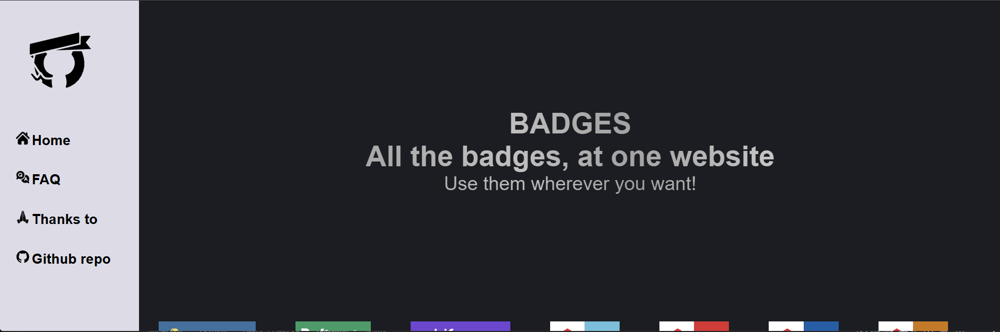

# GitHub Badges

Ready to use markdown svg badges.


## Purpose

Easily show what you know, what you have studied, the tools you use or how to get to your location 📌.


Click the image below to see the live site!

[](https://badges-codejovz.vercel.app/)


## Contribution
This project has a separate contibution file. Please adhere to the steps listed at the [contibuting file](./CONTRIBUTING.md).

## Badges + Link to use

|  AI / IDEs |  |
|-----------|--|
|  | `````` |
|  | `````` |
|  | `````` |
|  | `````` |
|  | `````` |
|  | `````` |
|  | `````` |
|  | `````` |
|  | `````` |
|  | `````` |
|  | `````` |

| Metro Ligero Madrid |  |
|--|--|
|  | `````` |
|  | `````` |
|  | `````` |
|  | `````` |

|  Cercanias Madrid  |  |
|---------------------------------------|--|
|     | `````` |
|     | `````` |
|     | `````` |
|    | `````` |
|    | `````` |
|     | `````` |
|     | `````` |
|    | `````` |
|    | `````` |
|    | `````` |
|  | `````` |

|  Buses Madrid  |  |
|---------------------------------------|--|
|  | `````` |
|  | `````` |
|  | `````` |


## SPECIAL THANKS TO

- [gemini](https://gemini.google.com/app?hl=es-ES) for generating the logo.
- [11zon](https://bigimage.11zon.com/es/crop-circle-image/convert-square-image-to-circle.php) for converting the logo to round.
- [convertio.co](https://convertio.co/download/d3bb8be23c34d62b07e1f19b59665d523a7076/) for converting the logo to SVG.
- [chatgpt.com/](https://chatgpt.com/) for generating images about svgs and markdown.
- [wikipedia.org](https://es.m.wikipedia.org/wiki/Archivo) for publishing logos. Contributors:
    - EMT Madrid
    - Javitomad
    - Patrick1977
    - Teoamez
    - That Argentinian on da' corner


<details>

<summary>I used React + Vite<hr/></summary>

Started from a template that provides a minimal setup to get React working in Vite with HMR and some ESLint rules.

Currently, two official plugins are available:

- [@vitejs/plugin-react](https://github.com/vitejs/vite-plugin-react/blob/main/packages/plugin-react) uses [Babel](https://babeljs.io/) for Fast Refresh
- [@vitejs/plugin-react-swc](https://github.com/vitejs/vite-plugin-react/blob/main/packages/plugin-react-swc) uses [SWC](https://swc.rs/) for Fast Refresh

## Expanding the ESLint configuration

If you are developing a production application, we recommend using TypeScript with type-aware lint rules enabled. Check out the [TS template](https://github.com/vitejs/vite/tree/main/packages/create-vite/template-react-ts) for information on how to integrate TypeScript and [`typescript-eslint`](https://typescript-eslint.io) in your project.

</details>